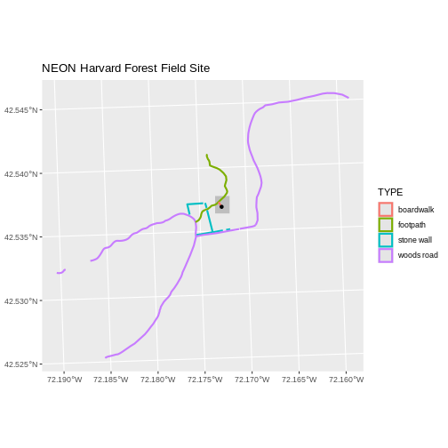

::::::::::::::::::::::::::::::::::::::: objectives

- Plot multiple vector layers in the same plot.
- Apply custom symbols to spatial objects in a plot.

::::::::::::::::::::::::::::::::::::::::::::::::::

:::::::::::::::::::::::::::::::::::::::: questions

- How can I create map compositions with custom legends using ggplot?
- How can I plot raster and vector data together?

::::::::::::::::::::::::::::::::::::::::::::::::::


::::::::::::::::::::::::::::::::::::::::::  prereq

## Things You'll Need To Complete This Episode

See the [lesson homepage](.) for detailed information about the software, data,
and other prerequisites you will need to work through the examples in this
episode.


::::::::::::::::::::::::::::::::::::::::::::::::::

This episode builds upon
[the previous episode](https://datacarpentry.org/r-raster-vector-geospatial/02-vector-shapefile-attributes-in-r)
to work with vector layers in R and explore how to plot multiple
vector layers.

## Load the Data

To work with vector data in R, we will exclusively use the `terra`
package. `sf` could also be used. 

We will continue to work with the three ESRI `shapefile` that we loaded in the
[Open and Plot Vector Layers in R](https://datacarpentry.org/r-raster-vector-geospatial/01-vector-open-shapefile-in-r) episode.

## Plotting Multiple Vector Layers

In the [previous episode](02-vector-shapefile-attributes-in-r/), we learned how
to plot information from a single vector layer and do some plot customization
including adding a custom legend. However, what if we want to create a more
complex plot with many vector layers and unique symbols that need to be
represented clearly in a legend?

Now, let's create a plot that combines our tower location (`point_harv`), site
boundary (`aoi_boundary_harv`) and roads (`lines_harv`) spatial objects. We
will need to build a custom legend as well.

To begin, we will create a plot with the site boundary as the first layer. Then
layer the tower location and road data on top using `+`.

Note that the legend only contains the lines, because that's where an
aesthetic uses a variable.


``` r
ggplot() +
  geom_spatvector(data = aoi_boundary_harv, fill = "grey", color = "grey") +
  geom_spatvector(data = lines_harv, aes(color = TYPE), size = 1) +
  geom_spatvector(data = point_harv) +
  ggtitle("NEON Harvard Forest Field Site") +
  coord_sf()
```



Next, let's customize legend a bit using the symbology (the colors and symbols)
that we used to create the plot above. For example, it might be good if the
lines were symbolized as lines (instead of the default little squares). In the previous episode, you may have noticed
that the default legend behavior for `geom_spatvector` is to draw a 'patch' for each
legend entry. If you want the legend to draw lines or points, you need to add
an instruction to the `geom_spatvector` call - in this case, `show.legend = 'line'`.


``` r
ggplot() +
  geom_spatvector(data = aoi_boundary_harv, fill = "grey", color = "grey") +
  geom_spatvector(data = lines_harv, aes(color = TYPE),
          show.legend = "line", size = 1) +
  geom_spatvector(data = point_harv, aes(fill = Sub_Type), color = "black") +
  scale_color_manual(values = road_colors) +
  scale_fill_manual(values = "black") +
  ggtitle("NEON Harvard Forest Field Site") +
  coord_sf()
```


Now lets adjust the legend titles by passing a `name` to the respective `color`
and `fill` palettes.


``` r
ggplot() +
  geom_spatvector(data = aoi_boundary_harv, fill = "grey", color = "grey") +
  geom_spatvector(data = point_harv, aes(fill = Sub_Type)) +
  geom_spatvector(data = lines_harv, aes(color = TYPE), show.legend = "line",
          size = 1) +
  scale_color_manual(values = road_colors, name = "Line Type") +
  scale_fill_manual(values = "black", name = "Tower Location") +
  ggtitle("NEON Harvard Forest Field Site") +
  coord_sf()
```


Finally, it might be better if the points were symbolized as a symbol. We can
customize this using `shape` parameters in our call to `geom_spatvector`: 16 is a point
symbol, 15 is a box.

:::::::::::::::::::::::::::::::::::::::::  callout

## Data Tip

To view a short list of `shape` symbols,
type `?pch` into the R console.


::::::::::::::::::::::::::::::::::::::::::::::::::


``` r
ggplot() +
  geom_spatvector(data = aoi_boundary_harv, fill = "grey", color = "grey") +
  geom_spatvector(data = point_harv, aes(fill = Sub_Type), shape = 15) +
  geom_spatvector(data = lines_harv, aes(color = TYPE),
          show.legend = "line", size = 1) +
  scale_color_manual(values = road_colors, name = "Line Type") +
  scale_fill_manual(values = "black", name = "Tower Location") +
  ggtitle("NEON Harvard Forest Field Site") +
  coord_sf()
```


:::::::::::::::::::::::::::::::::::::::  challenge

## Challenge: Plot Polygon by Attribute

1. Using the `NEON-DS-Site-Layout-Files/HARV/PlotLocations_HARV.shp` ESRI `shapefile`,
  create a map of study plot locations, with each point colored by the soil
  type (`soilTypeOr`). Make the colors "cornflowerblue" and "darkorange". How many different soil types are there at this
  particular field site? Overlay this layer on top of the `lines_harv` layer
  (the roads). Create a custom legend that applies line symbols to lines and
  point symbols to the points.

2. Modify the plot above. Tell R to plot each point, using a different symbol
   of `shape` value.

:::::::::::::::  solution

## Answers

First we need to read in the data and see how many unique soils are represented
in the `soilTypeOr` attribute.


``` r
plot_locations <-
  vect("data/NEON-DS-Site-Layout-Files/HARV/PlotLocations_HARV.shp")

plot_locations$soilTypeOr <- as.factor(plot_locations$soilTypeOr)
levels(plot_locations$soilTypeOr)
```

``` output
[1] "Histosols"   "Inceptisols"
```

Next we can create a new color palette with one color for each soil type.


``` r
blue_orange <- c("cornflowerblue", "darkorange")
```

:::::::::::::::::::::::::::::::::::::::::  callout

## Alternative Color Palettes

You can modify the default R color palette using the palette method. For
example `palette(rainbow(6))` or `palette(terrain.colors(6))`. You can reset
the palette colors using `palette("default")`!

You can also use colorblind-friendly palettes such as those in the
[viridis package](https://cran.r-project.org/package=viridis).


::::::::::::::::::::::::::::::::::::::::::::::::::

Finally, we will create our plot.


``` r
ggplot() +
  geom_spatvector(data = lines_harv, aes(color = TYPE), show.legend = "line") +
  geom_spatvector(data = plot_locations, aes(fill = soilTypeOr),
          shape = 21, show.legend = 'point') +
  scale_color_manual(name = "Line Type", values = road_colors,
     guide = guide_legend(override.aes = list(linetype = "solid",
                                              shape = NA))) +
  scale_fill_manual(name = "Soil Type", values = blue_orange,
     guide = guide_legend(override.aes = list(linetype = "blank", shape = 21,
                                              colour = "black"))) +
  ggtitle("NEON Harvard Forest Field Site") +
  coord_sf()
```


If we want each soil to be shown with a different symbol, we can give multiple
values to the `scale_shape_manual()` argument.


``` r
ggplot() +
  geom_spatvector(data = lines_harv, aes(color = TYPE), show.legend = "line", size = 1) +
  geom_spatvector(data = plot_locations, aes(fill = soilTypeOr, shape = soilTypeOr),
          show.legend = 'point', size = 3) +
  scale_shape_manual(name = "Soil Type", values = c(21, 22)) +
  scale_color_manual(name = "Line Type", values = road_colors,
     guide = guide_legend(override.aes = list(linetype = "solid", shape = NA))) +
  scale_fill_manual(name = "Soil Type", values = blue_orange,
     guide = guide_legend(override.aes = list(linetype = "blank", shape = c(21, 22), color = "black"))) +
  ggtitle("NEON Harvard Forest Field Site") +
  coord_sf()
```


:::::::::::::::::::::::::

::::::::::::::::::::::::::::::::::::::::::::::::::


:::::::::::::::::::::::::::::::::::::::: keypoints

- Use the `+` operator to add multiple layers to a ggplot.
- Multi-layered plots can combine raster and vector datasets.
- Use the `show.legend` argument to set legend symbol types.
- Use the `scale_fill_manual()` function to set legend colors.

::::::::::::::::::::::::::::::::::::::::::::::::::


